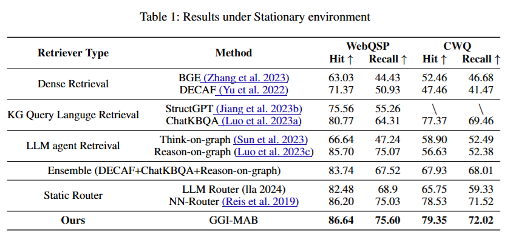

# Adapting to Non-Stationary Environments: Multi-Armed Bandit Enhanced Retrieval-Augmented Generation on Knowledge Graphs


**Proposed MAB-enhanced RAG framework.** The input query undergoes feature extraction (e.g., multi-entity query),
followed by the MAB algorithm, which selects the optimal retrieval method by predicting the most rewarding option (e.g.,
Query Language method). The selected method retrieves information from a Knowledge Graph (KG), and an LLM generates
the final response. Feedback is collected as a reward, updating the MAB model parameters online, and enabling continuous
adaptation to non-stationary environments.

## Dataset
To facilitate the reproduction of the results in this paper and avoid extensive local inference of LLMs, we provide an offline dataset. In this dataset, the final results generated by our RAG generator, based on different retrieval modules (e.g., dense retrieval, SPARQL-based retrieval), are pre-saved in the data folder. Data from the CWQ dataset is being organized and will be uploaded later.

## Training & Testing
Results from the static environment with GGI-MAB enhanced RAG:
```bash
python run.py --epochs 1 --lr 0.00001 --exp_name 3arm_MO_GGF_adaptive_optimize  --num_arms 3 --loss_policy MO_GGF_adaptive --warmup_ratio 0.02  --scheduler cosine --action_policy decay_greedy --test_action_policy none  --delay_scale 0.1 --weight_lr 0.005
```

Results from the online updating backend retriever in a non-stationary environment, here we simulate the backend retriever update from Think-on-Graph to Reason-on-Graph
```bash
python run.py --exp_name MO_GGF_adaptive_update_online --loss_policy MO_GGF_adaptive --online_learning --train_method_index "{0:'ToG',1:'Decaf_fid_gen',2:'ChatKBQA_gen'}" 

```

## Baselines
Compare to Llama index Router under non-stationary environment
```bash
python router.py
```
Compare to NN Router under non-stationary environment
```bash
python nn_router.py
```

Compare to offline MAB under non-stationary environment
```bash
python run.py --exp_name MO_GGF_adaptive_updata_offline --loss_policy MO_GGF_adaptive --train_method_index "{0:'ToG',1:'Decaf_fid_gen',2:'ChatKBQA_gen'}"
```


## Results
**Results under Non-stationary environment (mean ± std)**


**Results under Stationary environment**

